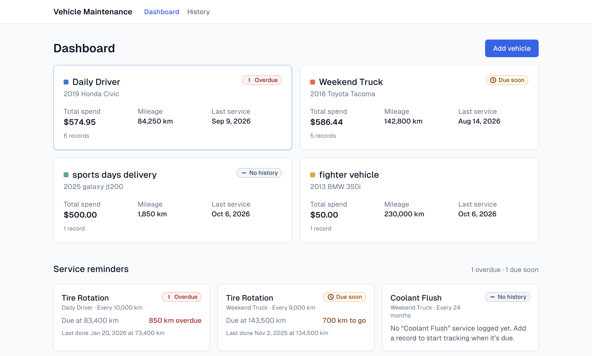
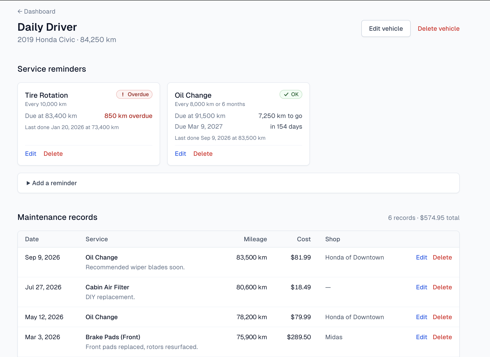
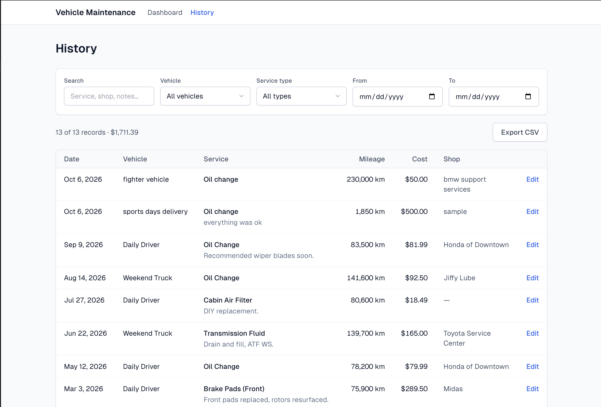

# Vehicle Maintenance Tracker

**Log every service, see what it costs, and know what's due next.**

## Overview

Vehicle Maintenance Tracker is a small full-stack web app for keeping a service history for one or more vehicles. Most people track maintenance on paper receipts, a notes app, or not at all — which makes it hard to answer simple questions: *When did I last change the oil? What has this car cost me this year? Is anything overdue?*

The app answers those questions in one place. Record each service with its date, mileage, cost and shop; browse and export the full history; see spending trends on a dashboard; and set distance- or time-based reminders that turn yellow when a service is coming up and red when it is overdue.

## ✨ Features

- **Vehicles** — add, edit and delete vehicles (name, make, model, year, current mileage). Deleting a vehicle removes its records and reminders.
- **Maintenance records** — add, edit and delete records per vehicle with date, mileage, cost, shop and notes. Deletes ask for confirmation.
- **Free-form service types** — a suggestion dropdown offers common services ("Oil change", "Brakes", "Tires", …) and types you have used before, but any custom value is accepted.
- **Server-side validation** — cost ≥ 0, mileage ≥ 0 (whole km), date not in the future, plus length and range checks, with inline field errors.
- **Dashboard**
  - Vehicle cards with all-time spend, mileage, last service date and the most urgent reminder status.
  - Total spend for the last 12 months.
  - Monthly cost bar chart, stacked by vehicle.
  - Cost breakdown by service type.
  - Each chart has a "Show as table" view with the exact figures.
- **Service reminders** — define an interval in kilometres, months, or both. Each reminder shows **OK**, **Due soon**, **Overdue** or **No history**, with the due mileage/date and how far away it is. Reminders appear on the dashboard (all vehicles, most urgent first) and on each vehicle page.
- **History** — every record across all vehicles, newest first, with:
  - text search across service type, vehicle, shop and notes;
  - filters for vehicle, service type and date range;
  - a live match count and total cost;
  - filters kept in the URL so a filtered view can be bookmarked or shared.
- **CSV export** — download exactly the filtered history as a CSV file, generated in the browser.
- **Polish** — empty states, loading skeletons, a mobile-friendly layout (tables become cards on small screens), and consistent currency, date and distance formatting.
- **Seed data** — two sample vehicles with a year of realistic records and reminders, so every screen has something to show on first run.

## 📸 Screenshots

| Dashboard | Vehicle detail | History |
|---|---|---|
|  |  |  |

## 🛠 Tech Stack

| Technology | Why |
|---|---|
| **Next.js 14 (App Router)** | Server components and server actions let pages read the database and handle forms directly, with no separate API layer. |
| **TypeScript** | End-to-end types from the Prisma schema through to the UI catch mistakes at compile time. |
| **Tailwind CSS** | Fast, consistent styling and responsive layouts without maintaining a separate stylesheet. |
| **Prisma** | Type-safe queries, a declarative schema and versioned migrations. |
| **SQLite** | Zero-config, file-based database — nothing to install or run alongside the app. |
| **Recharts** | Composable React charts with tooltips, used for the monthly and per-service cost charts. |

## 🚀 Getting Started

### Prerequisites

- **Node.js 18.18 or newer** (required by Next.js 14 and Prisma 6)
- npm (bundled with Node.js)

### Setup

1. **Clone the repository**

   ```bash
   git clone <repository-url> vehicle-maintenance-tracker
   cd vehicle-maintenance-tracker
   ```

2. **Create the environment file**

   ```bash
   cp .env.example .env
   ```

   This sets `DATABASE_URL="file:./dev.db"`, so the SQLite database is created at `prisma/dev.db`.

3. **Install dependencies**

   ```bash
   npm install
   ```

   The `postinstall` script runs `prisma generate` to build the Prisma client.

4. **Create the database**

   ```bash
   npm run db:migrate
   ```

   This applies the migrations in `prisma/migrations`. On a new database Prisma also runs the seed script automatically.

5. **Seed sample data**

   ```bash
   npm run db:seed
   ```

   Safe to run at any time: it clears all tables and loads the sample vehicles, records and reminders again. Sample dates are relative to today, so reminder statuses stay realistic.

6. **Start the development server**

   ```bash
   npm run dev
   ```

7. **Open the app** at [http://localhost:3000](http://localhost:3000).

### Available scripts

| Script | Description |
|---|---|
| `npm run dev` | Start the development server |
| `npm run build` | Create a production build |
| `npm start` | Serve the production build |
| `npm run lint` | Run ESLint |
| `npm run db:migrate` | Apply migrations (`prisma migrate dev`) |
| `npm run db:seed` | Reset and load sample data (`prisma db seed`) |
| `npm run db:studio` | Browse the database in Prisma Studio |

## 📁 Project Structure

```
app/
├── (dashboard)/page.tsx          Dashboard: vehicle cards, reminders, charts
├── vehicles/
│   ├── new/                      Add vehicle
│   └── [id]/                     Vehicle detail: reminders, records, add forms
│       ├── edit/                 Edit vehicle
│       ├── records/[recordId]/   Edit record
│       └── reminders/[reminderId]/  Edit reminder
├── history/                      All records with search, filters, CSV export
├── actions/                      Server actions (vehicles, records, reminders)
├── layout.tsx                    Root layout and top navigation
└── loading / error / not-found   Shared loading, error and 404 states
components/
├── charts/                       Recharts components (monthly cost, by service type)
├── forms.tsx                     Shared inputs, service type combobox, buttons
├── *Form.tsx                     Vehicle, record and reminder forms
├── HistoryView.tsx               Client-side filtering, URL sync and CSV export
└── ReminderCard.tsx, StatusBadge.tsx, EmptyState.tsx, Skeleton.tsx, …
lib/
├── reminders.ts                  Reminder due-status calculation
├── validation.ts                 Form parsing and validation rules
├── stats.ts                      Dashboard aggregates
├── csv.ts                        CSV generation and download
├── format.ts, dates.ts           Currency, number and date helpers
└── prisma.ts                     Shared Prisma client
prisma/
├── schema.prisma                 Data model
├── migrations/                   SQL migrations
└── seed.ts                       Sample data
docs/
├── ARCHITECTURE.md               Technical deep dive
└── screenshots/
```

## 🗄 Database Schema

```
┌──────────────────┐ 1      * ┌─────────────────────┐
│ Vehicle          │──────────│ MaintenanceRecord   │
│──────────────────│          │─────────────────────│
│ id               │          │ id                  │
│ name             │          │ vehicleId → Vehicle │
│ make             │          │ serviceType         │
│ model            │          │ date                │
│ year             │          │ mileage             │
│ currentMileage   │          │ cost                │
│ createdAt        │          │ shopName?           │
└──────────────────┘          │ notes?              │
         │ 1                  └─────────────────────┘
         │
         │ *  ┌─────────────────────┐
         └────│ ServiceReminder     │
              │─────────────────────│
              │ id                  │
              │ vehicleId → Vehicle │
              │ serviceType         │
              │ intervalKm?         │
              │ intervalMonths?     │
              └─────────────────────┘
```

- **Vehicle** — a car or truck with its current odometer reading.
- **MaintenanceRecord** — one service performed on a vehicle: what, when, at what mileage, and for how much.
- **ServiceReminder** — a recurring service for a vehicle, due every *N* km and/or every *N* months.

Both child tables reference `Vehicle` with `ON DELETE CASCADE` and are indexed on `vehicleId`.

## 🧭 Key Design Decisions

- **Free-form service types.** Service types are plain text rather than a fixed enum, because real service names vary ("Brake pads (front)", "Timing belt", "State inspection"). The input suggests common and previously used names to keep spelling consistent. Matching (for reminders, charts and filters) ignores case, so "Oil Change" and "oil change" count as the same service.
- **Reminder status is computed, not stored.** Status is derived on each request from the latest matching record, the vehicle's mileage and today's date, so it can never go stale.
  - A reminder is due at *last service mileage + interval km* and/or *last service date + interval months*, whichever comes first.
  - **Overdue** once either is passed; **Due soon** within 1,000 km or 30 days; otherwise **OK**.
  - **No history** when no matching record exists yet.
  - See [docs/ARCHITECTURE.md](docs/ARCHITECTURE.md#service-reminder-status) for the exact rules.
- **SQLite for zero-config setup.** The database is a single local file created by the migration, so the project runs with `npm install` and two database commands. Because Prisma abstracts the provider, moving to PostgreSQL later only needs a schema and connection-string change.
- **Server actions instead of an API.** Forms post directly to server actions, which validate input, write through Prisma and revalidate the affected pages. Forms also work without JavaScript.
- **Client-side CSV export.** The History page already holds the filtered rows in the browser, so export is instant, needs no endpoint, and always matches what is on screen.

## ⏱ Built in One Day

This project was built in a single day as part of a **one-day build challenge**. The scope was chosen to deliver a complete, polished workflow: data model, CRUD, history and export, dashboard analytics, and reminders. It deliberately leaves out authentication, multi-user support and deployment.
